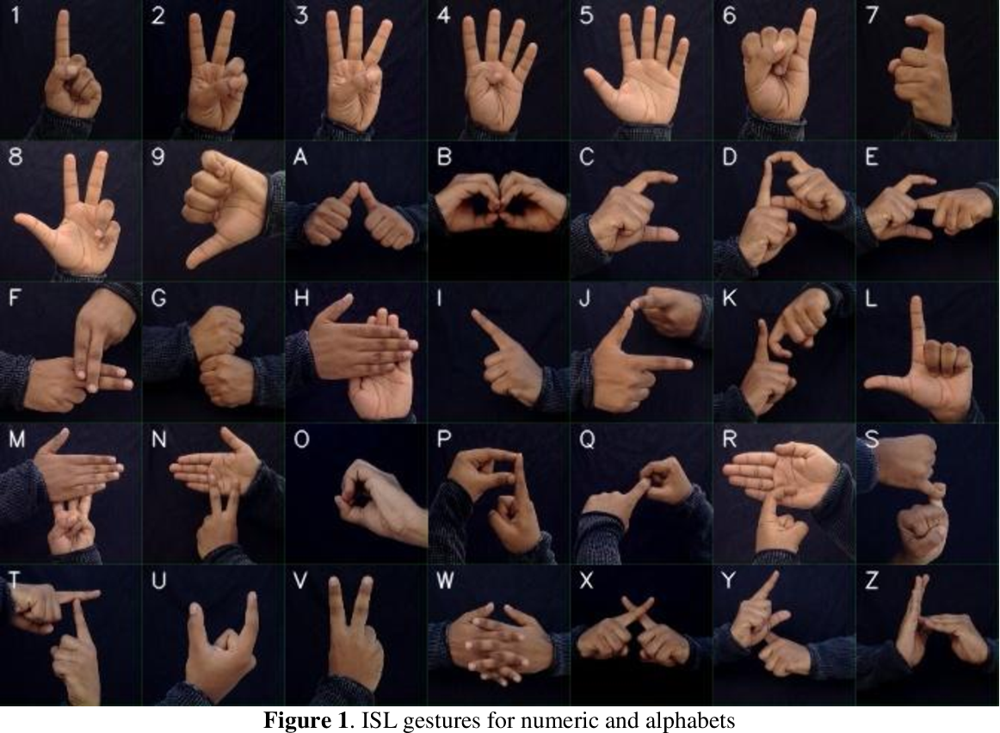

CNN-BASED INDIAN SIGN LANGUAGE DETECTION

This project uses a 1D Convolutional Neural Network (CNN) with TensorFlow/Keras to detect static Indian Sign Language gestures (A, B, C) in real-time from a webcam.

This is a conversion and optimization of an original RNN-based project. The CNN architecture was chosen to better learn the spatial patterns of hand keypoints, and the data pipeline has been rebuilt from scratch for better performance and generalization.

HOW IT WORKS

The model does not look at the raw video. Instead, it uses a highly efficient 2-step process:

1.  Hand Tracking (MediaPipe): In real-time, Google's MediaPipe scans the webcam feed to find the hand and extracts 42 keypoints (21 x,y coordinates).
    
2.  Preprocessing: These 42 keypoints are processed to match the training data (keypoint.csv):
    
    *   Normalization (Part 1): Keypoints are made relative to the wrist (landmark #0).
        
    *   Normalization (Part 2): The entire pose is scaled between -1.0 and 1.0 based on its maximum keypoint value.
        
3.  Prediction (CNN): This final (1, 42) array is fed into the trained isl\_cnn\_model.h5, which predicts the gesture.
    

HOW TO RUN THIS PROJECT

You can train the model from scratch or use the included pre-trained isl\_cnn\_model.h5 file.

STEP 1: CLONE THE REPOSITORY

git clone [https://github.com/arduvey29/ISL-Detection-CNN.git](https://github.com/arduvey29/ISL-Detection-CNN.git)
cd ISL-Detection-CNN.git

STEP 2: CREATE A VIRTUAL ENVIRONMENT

Windows (Git Bash or CMD):

python -m venv venv.\\venv\\Scripts\\activate

Mac/Linux:

python -m venv venvsource venv/bin/activate

STEP 3: INSTALL LIBRARIES

pip install -r requirements.txt

STEP 4: RUN THE LIVE DETECTION

python test\_cnn.py

Show gestures A, B, or C to the camera. It will show ... if no hand is detected.

STEP 5: (OPTIONAL) RE-TRAIN THE MODEL

python train\_cnn.py

PROJECT FILE STRUCTURE

project-root/
├── train\_cnn.py (Script for training the CNN model)
├── test\_cnn.py (Script for live webcam detection)
├── isl\_cnn\_model.h5 (Pre-trained Keras model file)
├── keypoint.csv (Dataset with 7,600+ hand poses)
├── dataset\_keypoint\_generation.py (Script to generate keypoint dataset)
├── requirements.txt (Python dependencies)
├── images/
   │ 
   └── allGestures.png (Demo image for README)
└── README.md (This file)

FILE DESCRIPTIONS

train\_cnn.py - Loads keypoint.csv, builds the CNN model, and saves isl\_cnn\_model.h5test\_cnn.py - Runs real-time webcam detection using MediaPipe and the trained modelisl\_cnn\_model.h5 - Final trained Keras model filekeypoint.csv - Master dataset containing 7,600+ hand poses with labelsdataset\_keypoint\_generation.py - Original script to create keypoint.csv datasetrequirements.txt - List of all necessary Python libraries

REQUIREMENTS

All dependencies are listed in requirements.txt. Key libraries include:

*   TensorFlow/Keras (for CNN model)
    
*   MediaPipe (for hand detection and keypoint extraction)
    
*   OpenCV (for webcam and image processing)
    
*   NumPy (for numerical computations)
    
*   Pandas (for data handling)
    
*   scikit-learn (for preprocessing)
    

MODEL ARCHITECTURE

The CNN model is simple yet effective:

*   Input Layer: Accepts 42 flattened keypoint values (21 landmarks × 2 coordinates)
    
*   Hidden Layer 1: 64 units with ReLU activation + 50% Dropout
    
*   Hidden Layer 2: 32 units with ReLU activation + 50% Dropout
    
*   Output Layer: Softmax activation with number of classes (gestures)
    

The model uses:

*   Optimizer: Adam
    
*   Loss Function: Categorical Crossentropy
    
*   Metrics: Accuracy
    
*   Callbacks: EarlyStopping (patience=5) and ModelCheckpoint
    

PERFORMANCE

*   Test Accuracy: Typically 85-95% depending on dataset quality
    
*   Real-Time Performance: Runs smoothly on standard laptops with no GPU
    
*   Inference Time: < 50ms per frame
    

UPLOAD TO GITHUB

STEP 1: CREATE A GITHUB REPOSITORY

1.  Go to GitHub.com and log in.
    
2.  Click the + icon in the top-right corner and select "New repository".
    
3.  Give it a name (e.g., CNN-Sign-Language-Detection).
    
4.  Click "Create repository".
    
5.  Do NOT check any boxes (like "Add a README" or "Add .gitignore"). You want an empty repository.
    

STEP 2: PUSH YOUR PROJECT TO GITHUB

In your terminal, inside your project folder (where train\_cnn.py is located):

git initgit add .git commit -m "Initial commit: CNN-based Indian Sign Language Detection"git branch -m maingit remote add origin [https://github.com/YOUR\_USERNAME/CNN-Sign-Language-Detection.git](https://github.com/YOUR_USERNAME/CNN-Sign-Language-Detection.git)git push -u origin main

STEP 3: VERIFY ON GITHUB

Refresh your GitHub repository page. Your project is now live with all files, README, and trained model.

NEXT STEPS & IMPROVEMENTS

*   Add support for more gestures (expand beyond A, B, C)
    
*   Implement dynamic gesture recognition (sequences of gestures)
    
*   Deploy as a web application using Flask/FastAPI
    
*   Create a mobile app using TensorFlow Lite
    
*   Add multi-hand detection support
    
*   Improve robustness with data augmentation
    

LICENSE

This project is open-source and available under the MIT License.

CONTRIBUTING

Contributions are welcome! Please feel free to open issues or submit pull requests.

CONTACT

For questions or support, please contact the project maintainer or open an issue on GitHub.

Happy coding!